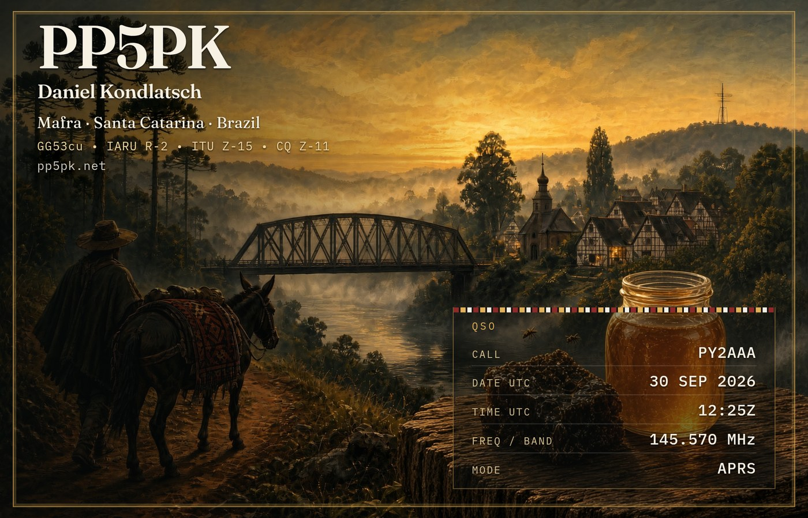

# QSL Card Creator

A small web app that creates printable **QSL cards** for amateur radio contacts.
Fill in the contact data by hand, or let your APRS system open the page already
filled in through URL parameters, then print the card or download it as a PNG.

The card in this repository is the QSL card of **PP5PK** (Mafra, Santa Catarina,
Brazil), but it is easy to adapt to any callsign (see [Customizing](#customizing)).



## Features

- Single-sided card, **140 × 90 mm**, with a translucent QSO data panel.
- Contact fields: call, date (UTC), time (UTC), frequency/band and mode.
- **APRS auto-fill**: open the page with the contact data in the URL.
- **Print** straight from the browser (or save as PDF), sized exactly 140 × 90 mm.
- **Download PNG** at print-friendly resolution.
- The last contact is remembered in the browser (`localStorage`).
- Works in Chrome, Opera and Firefox.

## Auto-fill through the URL

Every field can be passed as a query parameter:

| Parameter | Format                  | Example   |
| --------- | ----------------------- | --------- |
| `call`    | letters, digits and `/` | `PY2AAA`  |
| `date`    | `YYYY-MM-DD` (UTC)      | `2026-09-30` |
| `time`    | `HHMM` or `HH:MM` (UTC) | `1225`    |
| `freq`    | free text               | `145.570` |
| `mode`    | free text               | `APRS`    |

Example:

```
https://qsl.example.net/?call=PY2AAA&date=2026-09-30&time=1225&freq=145.570&mode=APRS
```

Values are sanitized on load. When no parameter is present, the last contact
saved in the browser is used (frequency and mode default to `144.390` and `APRS`).

## Quick start (development)

Requirements: **git** and **Node.js ^20.19 or >= 22.12 with npm** (an `.nvmrc` is provided;
see [Install everything the app needs](#1-install-everything-the-app-needs) if you need to install them).

```bash
git clone https://github.com/PP5PK/QSL_card_Creator.git
cd QSL_card_Creator
npm ci
npm run dev
```

The dev server listens on `http://localhost:8080`.

## Production deployment

This guide assumes a Debian/Ubuntu server with Apache as the public web server.
Apache terminates HTTPS and proxies requests to the app, which runs as a
systemd service on `127.0.0.1:3000`.

```
Browser ──HTTPS──▶ Apache (443) ──proxy──▶ srvx on 127.0.0.1:3000 ──▶ built app
```

Example configuration files are in [`templates/`](templates/). Replace
`qsl.domain.net` with your own domain everywhere.

### 1. Install everything the app needs

Install all the requirements **before** touching the app, so nothing surprises
you halfway through. Minimal server images (a fresh Debian, for example) usually
ship **without** Node.js, npm and git.

| Component                         | Why it is needed                                         |
| --------------------------------- | -------------------------------------------------------- |
| `git`                             | download the project and, later, updates                 |
| `curl`, `ca-certificates`         | add the Node.js repository and run the checks below      |
| **Node.js `^20.19` or `>= 22.12`** with **npm** | install dependencies, build and run the app |
| `apache2`                         | public web server (HTTPS and reverse proxy)             |
| `certbot`, `python3-certbot-apache` | free Let's Encrypt certificate                         |

You also need a **domain name already pointing to the server** and ports
**80 and 443** open to the internet (required by Let's Encrypt).

**System packages:**

```bash
sudo apt update
sudo apt install -y git curl ca-certificates apache2 certbot python3-certbot-apache
```

**Node.js and npm.** On Debian/Ubuntu the `nodejs` and `npm` packages from the
distribution repositories are often older than the version this project needs,
and `npm` may even be a separate package. The simplest way to get a supported
Node.js (npm is included) is the NodeSource repository:

```bash
curl -fsSL https://deb.nodesource.com/setup_22.x | sudo -E bash -
sudo apt install -y nodejs
```

Alternatively, use [nvm](https://github.com/nvm-sh/nvm).

**Apache modules:**

```bash
sudo a2enmod proxy proxy_http rewrite ssl
sudo systemctl restart apache2
```

**Check that everything is in place** before continuing:

```bash
git --version
node -v                 # must be v20.19+ or v22.12+
npm -v                  # must print a version
apache2 -v
certbot --version
apache2ctl -M | grep -E "proxy_module|proxy_http_module|rewrite_module|ssl_module"
```

If any command fails, fix it now. The next steps assume all of them pass.

### 2. Get the code and build it

```bash
cd /var/www/html
sudo git clone https://github.com/PP5PK/QSL_card_Creator.git cards
cd cards
npm ci
npm run build
```

The build is written to `.vercel/output/` (it is not committed to git).

Optional smoke test (stop it with Ctrl+C):

```bash
npm start
# in another terminal:
curl -sI http://127.0.0.1:3000/card/bg.jpg | head -1    # HTTP/1.1 200
```

### 3. Configure Apache

Create the HTTP virtual host from the template and enable it:

```bash
sudo cp templates/qsl.domain.net.conf /etc/apache2/sites-available/qsl.example.net.conf
sudo nano /etc/apache2/sites-available/qsl.example.net.conf     # set your domain
sudo a2ensite qsl.example.net
sudo systemctl reload apache2
```

Request the certificate (your DNS must already point to the server):

```bash
sudo certbot --apache -d qsl.example.net
```

Certbot creates `qsl.example.net-le-ssl.conf`. Edit it so that the `443` virtual
host proxies to the app instead of serving files, following
[`templates/qsl.domain.net-le-ssl.conf`](templates/qsl.domain.net-le-ssl.conf):

```apache
ProxyPreserveHost On
ProxyPass / http://127.0.0.1:3000/
ProxyPassReverse / http://127.0.0.1:3000/
```

Then check the syntax (it must print `Syntax OK`) and reload:

```bash
sudo apache2ctl configtest
sudo systemctl reload apache2
```

### 4. Create the systemd service

```bash
sudo cp templates/qsl.service /etc/systemd/system/qsl.service
sudo nano /etc/systemd/system/qsl.service    # adjust the paths if you did not use /var/www/html/cards
sudo systemctl daemon-reload
sudo systemctl enable --now qsl.service
```

Check that everything is running:

```bash
systemctl status qsl.service --no-pager
curl -sI http://127.0.0.1:3000/card/bg.jpg | head -1    # HTTP/1.1 200
```

Then open `https://qsl.example.net/` in your browser.

### Updating

After pulling new code or editing any file under `src/` or `public/`, rebuild
and restart the service. The service serves the **built** output, so restarting
alone does not apply source changes:

```bash
cd /var/www/html/cards
git pull
npm ci
npm run build
sudo systemctl restart qsl.service
```

## Customizing

All the card content lives in a few files:

| What                                            | Where                          |
| ----------------------------------------------- | ------------------------------ |
| Callsign, name, QTH, grid/zones, website        | `src/components/qsl-card.tsx`  |
| Card colors, fonts, positions and sizes         | `src/styles.css`               |
| Background image                                | `public/card/bg.jpg`           |
| Downloaded file name prefix (`PP5PK_...png`)    | `fileName()` in `src/lib/qso.ts` |
| Page header, helper texts, mode buttons         | `src/routes/index.tsx`         |
| Page title and description                      | `src/routes/__root.tsx`        |
| Print size (default 140 × 90 mm)                | `@page` rule in `src/styles.css` |

Tips:

- To move the identification block (callsign, name, QTH...) change `top` and
  `left` in the `.qsl-id` rule of `src/styles.css`. Values are percentages of
  the card, so the layout scales with it.
- The QSO data panel is styled by `.qsl-qso`; its darkness comes from the
  gradient in its `background`.
- The background image is scaled with `object-fit: cover` and cropped to the card ratio (14:9), so any
  image works; the current one is 1728 × 1152 px. Keep important details away from the edges.
- Rebuild and restart the service after any change (see [Updating](#updating)).

### Keep the card CSS safe for PNG export

The PNG is generated in the browser with
[modern-screenshot](https://github.com/qq15725/modern-screenshot). Some CSS
renders differently when exported, mostly in Firefox. If you restyle the card,
check the downloaded PNG in Firefox too. Two cases are already handled in this
project:

- `backdrop-filter` is not applied in the exported PNG, so the QSO panel uses a
  plain translucent gradient instead of a blur.
- `repeating-linear-gradient` is rendered incorrectly in Firefox exports, so the
  decorative stripe above the QSO panel is a small inline SVG tile.

## Project structure

```
.
├── docs/                 Screenshot used by this README
├── public/               Static files (card background, favicon)
├── src/
│   ├── components/       QSL card component
│   ├── lib/              QSO parsing/formatting helpers
│   ├── routes/           Page (TanStack Router)
│   └── styles.css        Card and page styles
├── templates/            Example Apache and systemd configuration
├── package.json
└── vite.config.ts
```

Built with [TanStack Start](https://tanstack.com/start), React, Vite and
Tailwind CSS. Production runs through [srvx](https://github.com/h3js/srvx).

## Troubleshooting

- **My changes do not show up**: rebuild and restart the service
  (`npm run build && sudo systemctl restart qsl.service`). Use a private window
  to rule out browser cache.
- **502 / Bad Gateway from Apache**: the service is not running or not on port
  3000. Check `systemctl status qsl.service` and
  `journalctl -u qsl.service -n 50 --no-pager`.
- **Service fails to start**: confirm that `node_modules/.bin/srvx` and
  `.vercel/output/` exist (run `npm ci` and `npm run build`) and that the paths
  in `qsl.service` match where you installed the project.
- **`apache2ctl configtest` complains about `Proxy`/`Rewrite`**: enable the
  modules with `sudo a2enmod proxy proxy_http rewrite ssl`.
- **`npm: command not found`**: npm is not installed. Install Node.js with npm as
  described in [step 1](#1-install-everything-the-app-needs).
- **Build fails with a Node.js version error**: this project needs Node.js
  `^20.19` or `>= 22.12`.

## License

Released into the public domain under [The Unlicense](LICENSE).

73 de PP5PK
